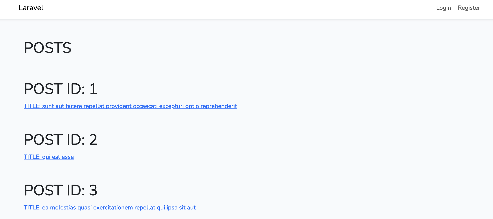
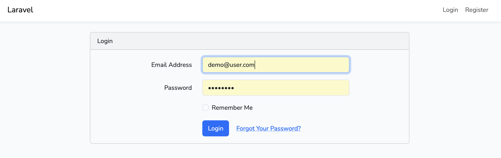
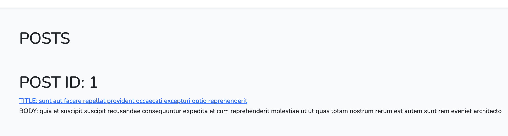

# LARAVEL APP - HIDE PARTIAL DATA FROM A FETCH REQUEST

-   This project was given as an in-office task of StudentKhabri.
-   `https://jsonplaceholder.typicode.com/posts/` was given to fetch the posts from.
-   When user clicks the title, it should be routed to the post page.
-   `SQL` and `Bootstrap Authentication` was used with it.
-   The `body` of the posts are hidden on the home page which requires user to login and see the rest of the data.

## POSTS

THis is how the home page looks. The body section of the posts are hidden unless user logs in:

## Login

Bootstrap auth boiler plate was integrated for users to login and see the body data.

## Authentication

After authenticating the user, the body of the posts show up.

